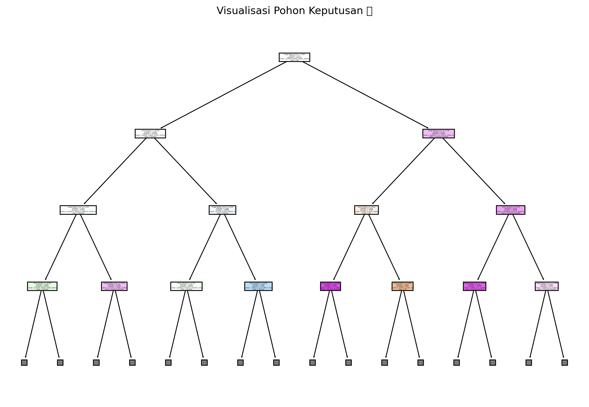
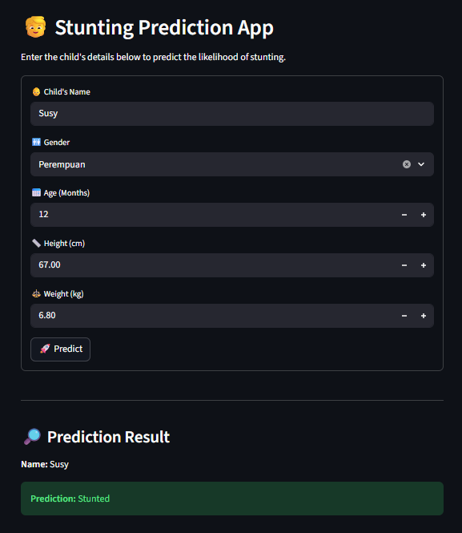

# 👶 Stuntify: Intelligent Stunting Prediction System


## 📌 Overview
**Stuntify Web App** is an End-to-End Machine Learning application designed to democratize access to early stunting detection.

It isn't just a dashboard; it's an **intelligent decision support system**. By bridging the gap between complex medical data and a user-friendly interface, Stuntify allows users to input simple anthropometric measurements and receive instant, medically-aligned classifications. Under the hood, it orchestrates a rigorous **MLOps Inference Pipeline**, ensuring that every user input undergoes the exact same preprocessing standards as the clinical training data.

## ✨ Key Features

### 🧠 Multi-Artifact Orchestration (The "Invisible" Brain)
The system acts as a synchronized inference unit. It doesn't just "guess"; it reconstructs the mathematical environment by loading 4 frozen artifacts:
* **Gender Encoder:** Translates categories (`Laki-laki`) into machine-readable vectors.
* **Standard Scaler:** Normalizes input metrics (`Age`, `Height`, `Weight`) to match the model's distribution.
* **Classifier Model:** The core logic engine (Random Forest/Decision Tree) trained for high precision.
* **Target Decoder:** Translates the mathematical prediction back to human-readable labels (e.g., `Severely Stunted`).

### 🛡️ Defensive & Modular Architecture
* **Decoupled Logic:** Separation of concerns via `preprocess.py` (Schema), `model.py` (Inference), and `app.py` (UI).
* **Input Sanity Checks:** The UI enforces strict min/max value constraints to prevent biological impossibilities (e.g., negative height).
* **Production Simulation:** Includes a comprehensive simulation pipeline to verify data integrity before inference.

## 🛠️ Tech Stack
* **Core:** Python 3.9+
* **Frontend:** Streamlit (Interactive Web Framework)
* **Computation:** NumPy, Pandas, Scikit-Learn, Joblib
* **Handling Imbalance:** SMOTE-NC (Synthetic Minority Over-sampling Technique)

## 📂 Project Structure
The repository is organized to simulate a real-world production environment:

```bash
📂 app                                    # 🧠 Core application logic
│   ├── 🐍 app.py                         # 🚀 Streamlit UI (main frontend entry point)
│   ├── 🐍 model.py                       # ⚙️ Model inference logic & artifact loader
│   ├── 🐍 preprocess.py                  # 🛠️ Data preprocessing utilities & feature encoding
│   └── 📂 __pycache__                    # 🔒 Auto-generated Python bytecode cache
│
📂 assets                                 # 🎨 Visual assets for documentation & UI preview
│   ├── 📄 decision_tree.pdf              # 📑 Decision tree visualization (PDF format)
│   ├── 🖼️ decision_tree.png              # 🌳 Decision tree visualization (image preview)
│   └── 🖼️ app_interface.png              # 📱 Screenshot of the Streamlit application interface
│
📂 models                                 # 📦 Serialized ML artifacts (model & encoders)
│   ├── 📦 gender_encoder.joblib          # 🔤 Encoder for gender feature
│   ├── 📦 stunting_encoder.joblib        # 🔤 Encoder for target label categories
│   ├── 📦 best_model.joblib              # 🧠 Final trained machine learning model
│   └── 📦 scaler.joblib                  # 📊 Feature scaling model
│
📂 notebooks                              # 🔬 Research & experimentation workspace
│   └── 📓 stunting-prediction.ipynb      # 📈 EDA, SMOTE, model training & evaluation notebook
````

## 🚀 The Inference Pipeline (How It Works)

Unlike basic notebooks, this project implements a strict lifecycle for every user interaction:

1.  **Ingestion:** The User inputs data via the Streamlit Form: `{"Gender", "Age", "Height", "Weight"}`.
2.  **Schema Alignment:** `preprocess.py` transforms raw inputs into a structured DataFrame matching the training schema.
3.  **Context Reconstruction:** `model.py` loads the serialized artifacts.
4.  **Processing:** The data flows through the pipeline:
    > *Input Validated -\> Encoded -\> Scaled -\> Predicted -\> Decoded*
5.  **Visualization:** The result is presented instantly with clear, actionable context.

## ⚖️ Performance & Disclaimer

| Metric        | Score    | Note                                                      |
| :------------ | :------- | :-------------------------------------------------------- |
| **Accuracy**  | **100%** | All predictions are correct based on the confusion matrix |
| **Recall**    | **100%** | No stunting cases were missed (perfect sensitivity)       |
| **Precision** | **100%** | No false positives across all classes                     |

### ⚠️ Why is Accuracy near 100%?

You might notice the model achieves near-perfect accuracy. This is **not a sign of overfitting**, but rather a reflection of the **deterministic nature** of the dataset.

  * **Clinical Logic:** Stunting is medically defined by a strict formula involving *Height-for-Age*.
  * **Model Behavior:** The model has successfully "reverse-engineered" these medical rules derived from WHO Growth Standards.
  * **Conclusion:** The model functions correctly as a **Rule-Approximation System**.

## 📦 Installation & Usage

1.  **Clone the Repository**

    ```bash
    git clone https://github.com/viochris/stunting-prediction.git
    cd stunting-prediction
    ```

2.  **Install Dependencies**

    ```bash
    pip install -r requirements.txt
    ```

3.  **Run the Web App**
    Execute the Streamlit application:

    ```bash
    streamlit run app/app.py
    ```

    *Output: The app will open in your browser at `http://localhost:8501`*


## 📷 Model & Application Screenshots

### Decision Tree Visualization
A preview of the decision tree structure used in the stunting prediction model:


### Streamlit Application Interface
Example interface when entering input data for stunting prediction:


-----
**Author:** [Silvio Christian, Joe](https://www.linkedin.com/in/silvio-christian-joe)
*"Code that speaks Data, Logic that saves lives."*
